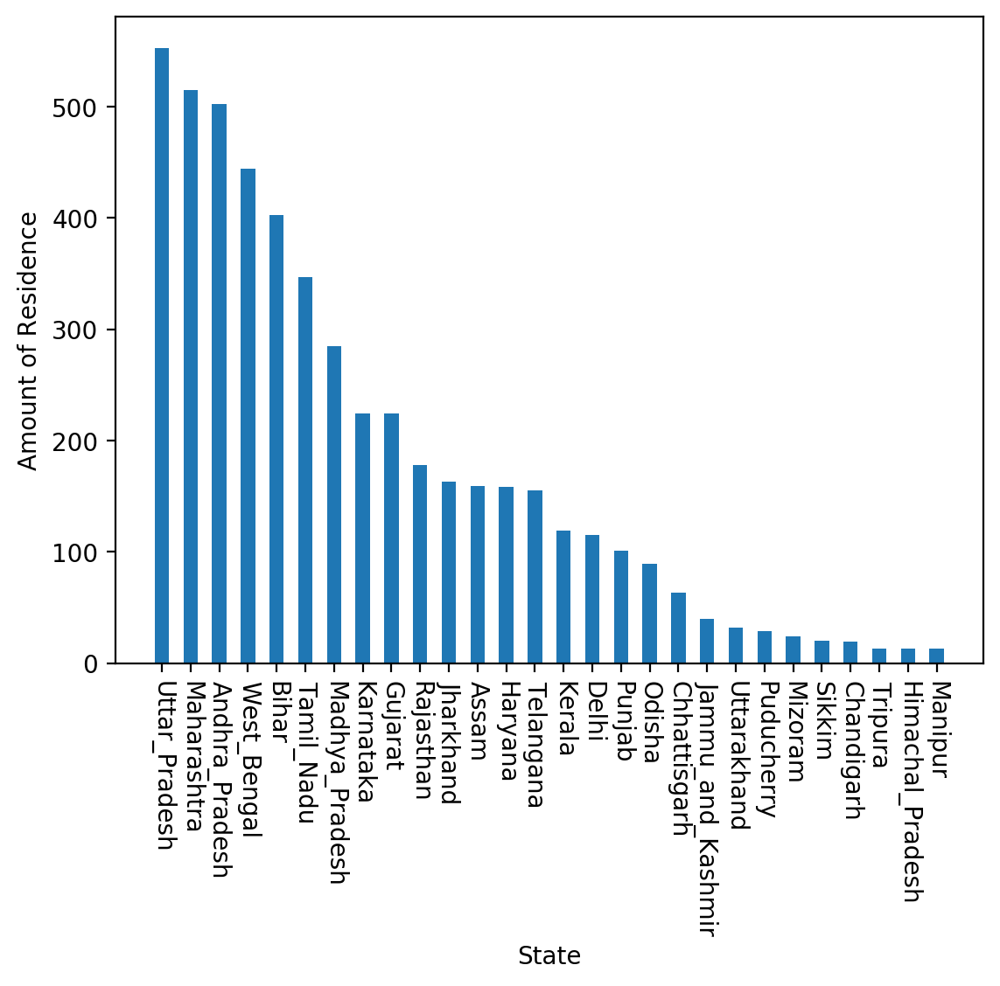
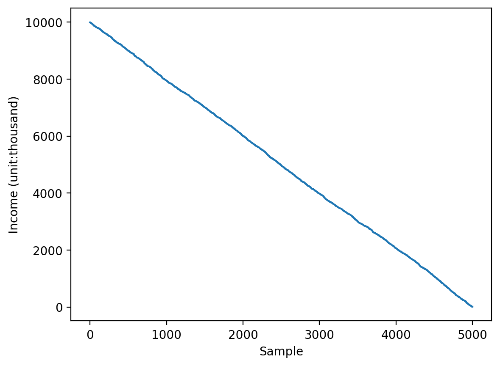
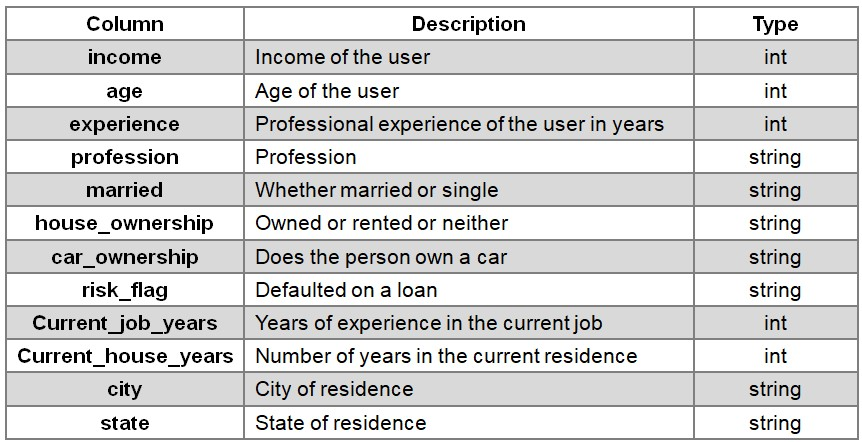
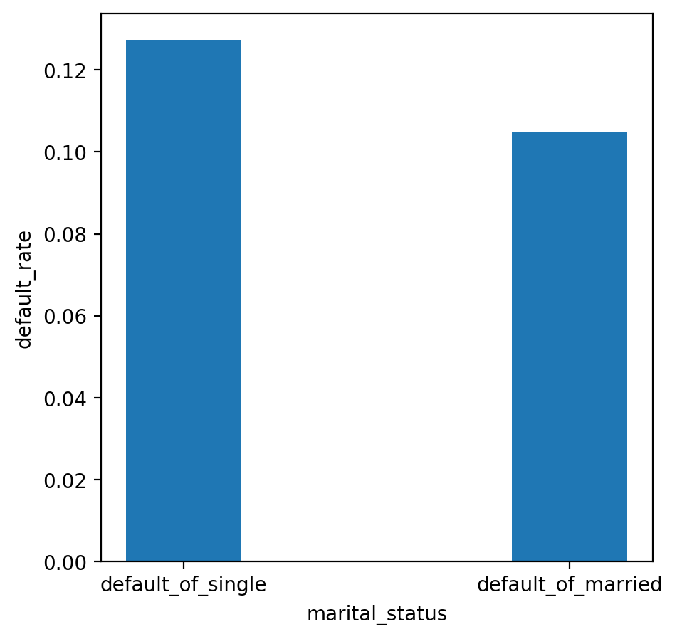
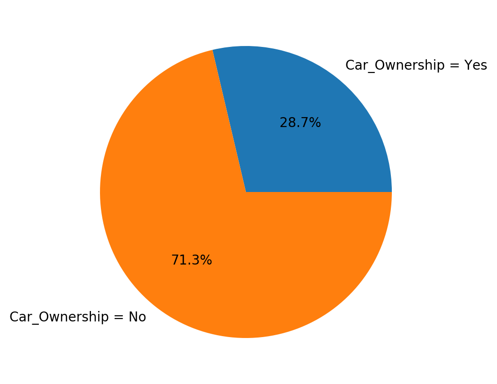
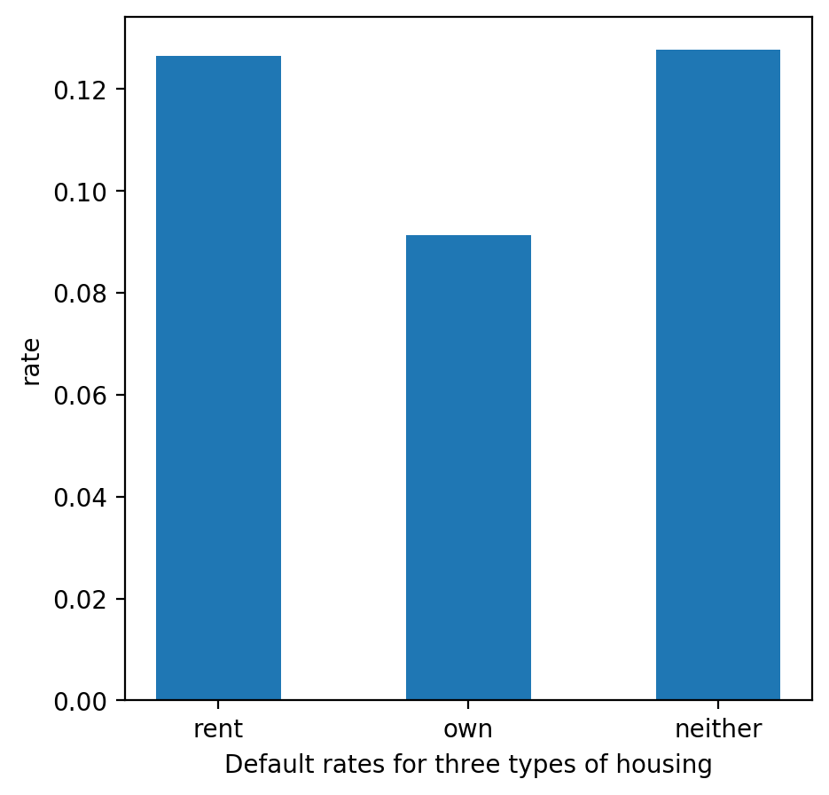

# Loan Prediction Based on Customer Behavior
 
Predict who possible Defaulters are for the Consumer Loans Product

# 1. Data set description

## 1.1 Research Background

* An organization wants to predict who possible defaulters are for the consumer loans product. They have data about historic customer behavior based on what they have observed. Hence when they acquire new customers they want to predict who is riskier and who is not.

## 1.2 Research Purpose

* Based on historical data, our group explore the factors that influence default rate, such as job seniority, asset ownership and age range.

## 1.3 Commercial Value

* The research is helpful for enterprises to assess the risks of product delivery objects according to their attributes.

## 1.4 Research Scope & Object

The data set covers 26 states around the world, including groups with an annual income between 10 thousands and 10 millions. 

## 1.5 Attributes of Dataset
The dataset contains 11 different attributes:

Our research mainly focus on the impact of income, age, job qualifications, marital status and ownership factors on the risk of default. 

## Data Set Link
<https://www.kaggle.com/datasets/subhamjain/loan-prediction-based-on-customer-behavior>

# Problem Analysis

## 1.1 Explore the potential factors affecting the default rate.

Fig. 1-4 shows that the default rate of single people is higher than that of married people (the gap is about 0.022%).

Fig. 1-5 shows that the default rate of the group that does not own the car (0.713%) is about 2.5 times higher than that of the group who own the car (0.287%).

Fig. 1-6 shows that the default rate of rental groups (12.655%) is higher than that of homeowners (9.127%). 

## Conclusion
Marital status and asset ownership (house and car) are correlated with default rate, and groups with lack of asset ownership or single marital status are more likely to be default.

## 1.2 Relationship Between Profession Experience and Default Possibility

* The figure shows that there is a significant negative correlation between years of work experience and default rate. 

* The group with 0-4 years of work experience had the highest default rate (15.716%), and the group with 16-20 years of work experience had the lowest default rate (11.214%).

## 1.3 Default Ratio of Different Age Groups

* The picture does not show a clear relationship between default rates and age

* The default rate is the lowest in 60-70 age group(10.138%) and the highest in20-30 age group(14.504%).The gap between the default rate of 40-50 and 50-60 age groups is small(about 0.0004948).

# Further study
***

* Algorithm:Using the random forest algorithm to rank the importance of some features 
* The importance of these features on the impact of loan default results is ranked as follows:
1. Income
2. Age 
3. Experience 
4. Current_job_years 
5. Current_house_years
* Score for the training data set : 98.29%
* Score for the testing data set : 87.87%

# Website 
<http://128.175.145.11:8501>